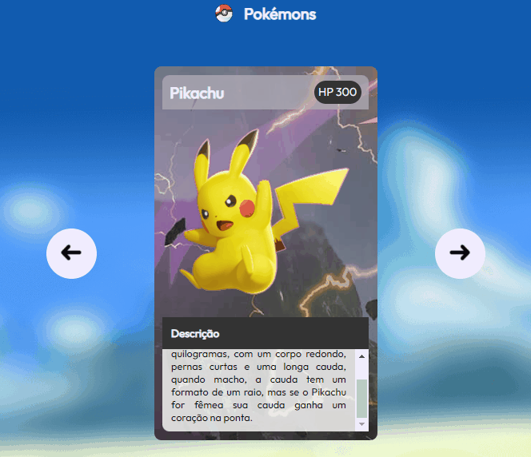

# Projeto Pokémon

Projeto utilizado na intrdoução do estudo à tríade do front-end  🧙‍♂️ 

</img>


Este projeto referente à apresentação de três pokémons, podendo transitar entre eles, é essencial para programadores iniciantes.


## Tecnologias Utilizadas:

- HTML
- CSS 
- JavaScript

## Principais aprendizados

- Títulos e parágrafos;
- Criação de listas;
- Inserção de imagens;
- Configurações de botões;
- Classes e Id's;
- Margin, padding e border;
- Cores do CSS;
- Estilização;
- Código mais limpo;
- Funcionalidades do JavaScript.

## Como utilizar

1 - Crie uma pasta com o mkdir * nome da pasta * (dentro do Terminal)
```
$ mkdir * nome da pasta *

````

2 - Avance para a pasta selecionada com cd * nome da pasta * (dentro do Terminal)

```
$ cd * nome da pasta *

```

3 - utilize o git clone junto da url do projeto no GitHub

````
$ git clone * url *

````

4 - abra com o VS Code

5 - Divirta-se!


